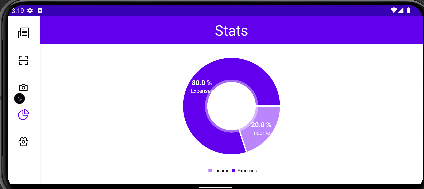
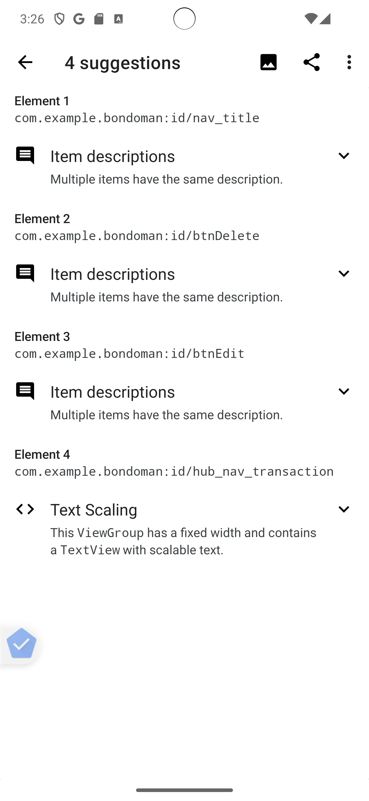

# BondoMan

> Tugas Besar 1 IF3210 Pengembangan Aplikasi pada Platform Khusus - Kelompok GUY

## Deskripsi Aplikasi

**BondoMan** merupakan aplikasi manajemen keuangan yang dibangun khusus untuk platform Android. Aplikasi ini dibangun dengan menggunakan Android Studio. Bahasa pemrograman yang digunakan adalah Kotlin dengan minimum SDK 29 dan target SDK 32. 

Dalam aplikasi ini, pengguna dapat melakukan hal-hal berikut.

- Menavigasi aplikasi melalui header dan navbar
- Login dan logout
- Menambahkan, mengubah, dan menghapus transaksi
- Melihat daftar transaksi yang sudah dilakukan
- Scan nota
- Melihat graf rangkuman transaksi
- Menyimpan daftar transaksi dalam format .xlsx, .xls
- Mengirim file daftar transaksi (dalam format .xlsx, .xls) melalui Gmail
- Melakukan randomize transaksi
- Membuat twibbon

## Library

- Android Core
- Room
- Retrofit
- Fused Location Client
- Recycler View
- Data Faker
- dll.

## Screenshot Aplikasi

### Splash Screen

### Login

### Transaksi

### Tambah Transaksi

### Scan Nota

### Graf

#### Potrait

#### Landscape

### Settings

### Twibbon

## Bonus

### Twibbon

Lihat pada bagian [Twibbon](#twibbon).

### Accessibility Testing

#### Login

##### Suggestion sebelum Diperbaiki

##### Perbaikan yang Dilakukan
- Mengubah layout tengah menjadi match_parent lalu menambahkan padding horizontal
- Mengubah width height EditText password menjadi wrap_content namun memberikan atribut maxHeight dan scrollHorizontally true
##### Suggestion setelah Diperbaiki

#### Transaksi

##### Suggestion sebelum Diperbaiki

##### Perbaikan yang Dilakukan
- Menambah id pada contentDescription yang sama
##### Suggestion setelah Diperbaiki

#### Tambah Transaksi

##### Suggestion sebelum Diperbaiki

##### Perbaikan yang Dilakukan
- Mengubah width height EditText dan Spinner menjadi wrap_content namun memberikan atribut maxHeight dan scrollHorizontally true
##### Suggestion setelah Diperbaiki

#### Scan Nota

##### Suggestion sebelum Diperbaiki

##### Perbaikan yang Dilakukan
- Menambah contentDescription pada header
- Mengubah width height Button menjadi wrap_content namun memberikan atribut maxHeight dan maxWidth
##### Suggestion setelah Diperbaiki

#### Graf

##### Suggestion sebelum Diperbaiki

##### Perbaikan yang Dilakukan
- Menambah contentDescription pada header
##### Suggestion setelah Diperbaiki

#### Settings

##### Suggestion sebelum Diperbaiki

##### Perbaikan yang Dilakukan
- Menambah contentDescription pada header
##### Suggestion setelah Diperbaiki

## Pembagian Kerja

| Pekerjaan                                                                | NIM                          |
| ------------------------------------------------------------------------ | ---------------------------- |
| Header dan Navbar                                                        | 13521095                     |
| Login - Halaman Login                                                    | 13521129                     |
| Logout - Halaman Pengaturan                                              | 13521129                     |
| Melakukan Penambahan, Pengubahan, dan Penghapusan Transaksi              | 13521095                     |
| Melihat Daftar Transaksi yang Sudah Dilakukan                            | 13521129                     |
| Melakukan Scan Nota - Halaman Scan Nota                                  | 13521149                     |
| Melihat Graf Rangkuman Transaksi - Halaman Graf                          | 13521129                     |
| Menyimpan Daftar Transaksi dalam Format .xlsx, .xls - Halaman Pengaturan | 13521095                     |
| Intent GMail - Halaman Pengaturan                                        | 13521095                     |
| Background Service - Mengecek expiry JWT                                 | 13521129                     |
| Network Sensing - Deteksi Sinyal                                         | 13521149                     |
| Broadcast Receiver - Randomize Transaksi dari Pengaturan                 | 13521095, 13521129           |
| Bonus: Twibbon                                                           | 13521149                     |
| Bonus: Accessibility Testing                                             | 13521095, 13521129, 13521149 |

## Durasi Persiapan dan Pengerjaan

| NIM      | Durasi Persiapan (jam) | Durasi Pengerjaan (jam) |
| -------- | ---------------------- | ----------------------- |
| 13521095 | 24                     | 48                      |
| 13521129 | 24                     | 48                      |
| 13521149 | 24                     | 48                      |

## Authors

| NIM      | Nama                 |
| -------- | -------------------- |
| 13521095 | Muhamad Aji Wibisono |
| 13521129 | Chiquita Ahsanunnisa |
| 13521149 | Rava Maulana Azzikri |
